# CCNA HANDS ON PRACTISE

---

## Attribution & Source

This lab is adapted from the original work available at:

https://github.com/DevDanielAwele/labs/blob/main/gns3vault-archive/CCNA%20RS/icnd1-assesment-lab/icnd1-assesment-lab.md

The original lab was sourced from NetworkLessons github repo and some of Jeremys IT LAB. This version has been modified to reflect modern infrastructure practices, including improved structure, clearer task separation, enhanced security emphasis, and alignment with enterprise workflows.

## Scenario

   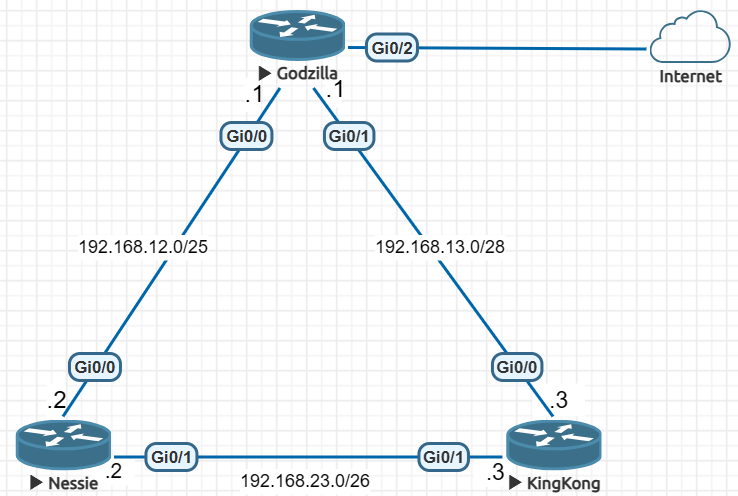

You are configuring a network consisting of three routers named **godzilla**, **kingkong**, and **nessie**.

The objective is to establish full connectivity across all networks using:
- Structured configuration  
- Secure access controls  
- Dynamic routing  

This lab simulates a real enterprise environment under the organization **DanCorp**.

# LAB TASKS (Answers)

## Device Identity and Base Configuration
Configure each router with the hostname godzilla, kingkong, and nessie respectively and verify that the hostname is correct. Configure the domain name as dancorp.com and confirm that it is applied. Disable DNS lookup to prevent delays caused by mistyped commands and verify that incorrect commands no longer trigger name resolution attempts. Configure a secure enable secret "jeremysitlab" and confirm that it is stored in most encrypted form available on the routers. Ensure that no enable password exists in the configuration and verify that unauthorized users cannot access privileged EXEC mode.

#### Answers

  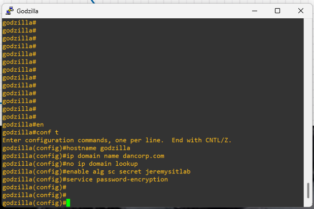
  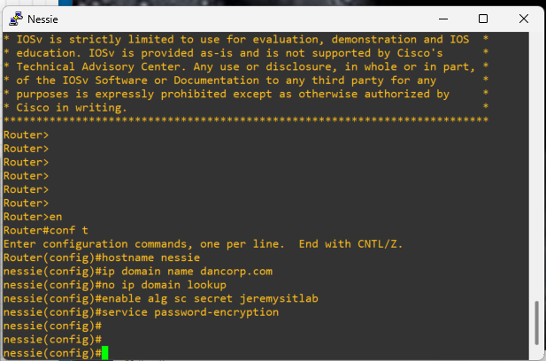 
  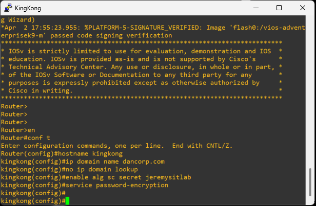

## IP Addressing and Subnet Design
Assign IP addresses to all router interfaces based on the addressing scheme provided in the topology diagram shown above. Determine the correct subnet masks for each network segment without relying on predefined values and ensure all IP addresses fall within valid ranges. Verify that there are no overlapping addresses or conflicts. Confirm connectivity between directly connected routers using ping and ensure all interfaces in use are operational. Configure "godzialla" to provide the default route to the internet for the entire network, the interface leading to the internet will be a dchp client to the ISP network.

#### Answers

For the IP addressing, the subnet mask we need for the configuration is in the "SLASH" notation, but we need it to appear in the decimal notation. 

Hence,

- 192.168.12.0/25 -> 192.168.12.* 255.255.255.128

- 192.168.13.0/28 -> 192.168.13.* 255.255.255.240

- 192.168.23.0/26 -> 192.168.23.* 255.255.255.192

#### godzilla

  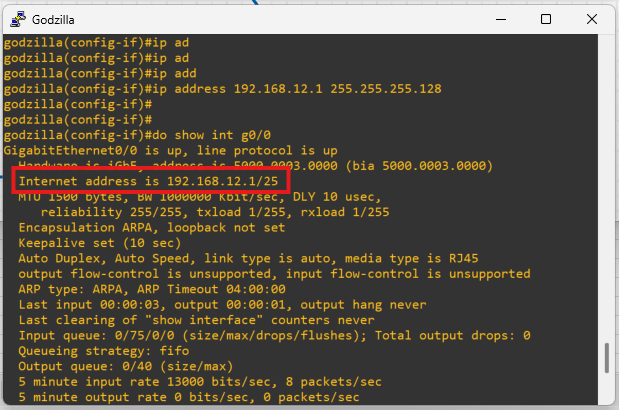
  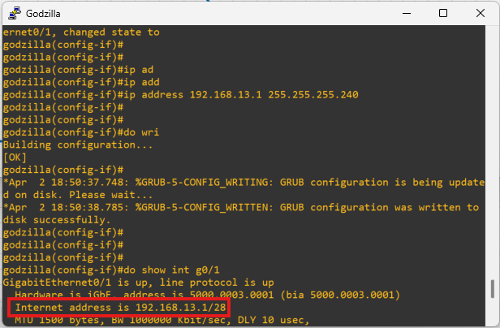 

#### nessie

  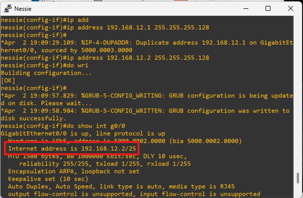
  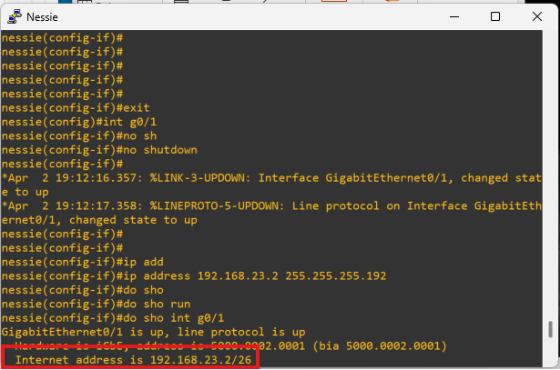 

#### kingkong

  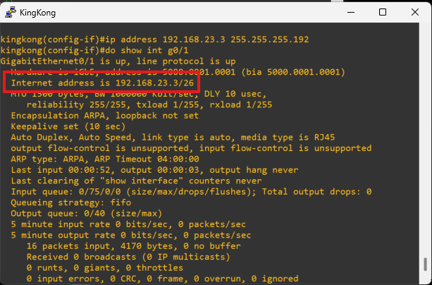
  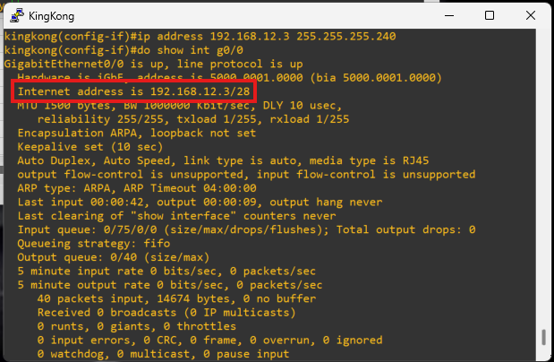 

## Console Access Configuration
Configure a user account "cisco" with secret "ccna", ensuring that it is protected using the strongest encryption method supported by the device Configure the console line to require login with a local user account. Set an 30-minute exec timeout. Enable synchronous logging.

  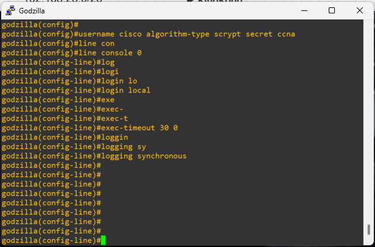
  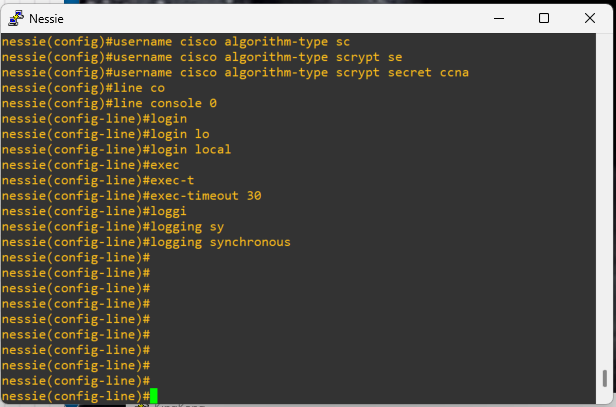 
  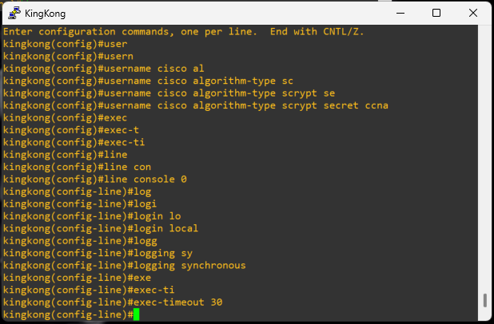

## SSH Configuration
Ensure the domain name "dancorp.com" is configured, then generate RSA keys with a maximum available size of 4096 bits. Enable SSH version 2 only and verify that SSH is active. Test remote access by connecting from another device using SSH and confirm that login is successful using the cisco user account. Verify that Telnet connections are rejected and that sessions are encrypted.

  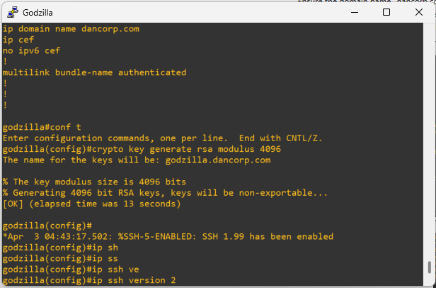
   
  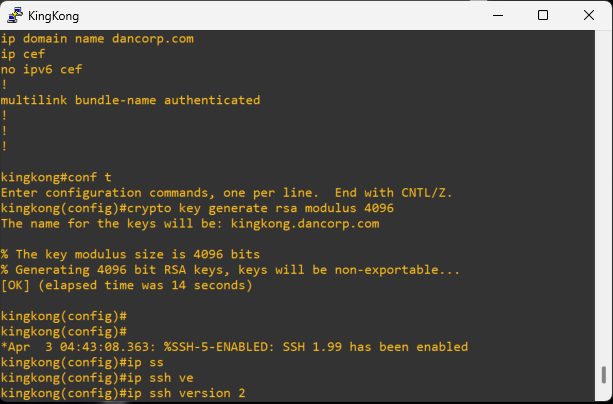

## Banner and Legal Notice
Configure a message of the day banner that includes a security warning stating that "Unauthorized access to DanCorp systems is prohibited and that all activity may be monitored. Unauthorized breach is subject criminal and civil litigation." Verify that the banner is displayed before login on all access methods.

## Interface Preparation and Device Hardening
Shut down all unused interfaces and apply descriptions to active interfaces indicating the connected device. Verify that only required interfaces are up and confirm their operational status. Disable unnecessary services such as the HTTP server and HTTPS server. Verify that no web-based access is available to the device.

## Logging, Time, and System Integrity
Enable logging timestamps and configure buffered logging. Generate a test log event and verify that logs are recorded correctly. Set the correct time zone and verify system time. Configure NTP if available and confirm that time synchronization is functioning.

## Configuration Management
Save the running configuration to startup-config and verify that the configuration is retained after a reload. Compare running and startup configurations to confirm consistency.

## Loopback Configuration and Router Identification
Create loopback interfaces on each router and assign the following addresses:  
- godzilla → 1.1.1.1/24  
- nessie → 2.2.2.2/24  
- kingkong → 3.3.3.3/24  

Verify that loopbacks are reachable from all routers and use them as router IDs where required.

## OSPF Configuration and Routing Behavior
Configure OSPF on all routers using process ID 1. Assign router IDs manually using the loopback interfaces. Place all interfaces into area 0 and verify that neighbor adjacencies are formed. Confirm that routing tables contain all expected networks and that routes are learned dynamically.

## Static and Default Routing
Configure a static route on one router to simulate external network access and configure a default route on godzilla. Verify that the default route is propagated through OSPF and appears in the routing tables of other routers.

## Failure Testing and Convergence
Shut down a link between two routers and observe the changes in routing tables. Verify that alternate paths are used where available and that connectivity is maintained. Restore the link and observe OSPF convergence to ensure the network stabilizes correctly.

## Security Reinforcement and Validation
Verify that all passwords are encrypted, that only SSH access is permitted, and that unnecessary services are disabled. Confirm that access control mechanisms are working correctly and that unauthorized access is prevented.

## Troubleshooting and Recovery
Identify and resolve issues such as missing routes, OSPF adjacency failures, incorrect network statements, and misconfigured static routes. Restore full connectivity across all routers and confirm that the network operates correctly under normal and failure conditions.

## Final Objective
Ensure that all routers can reach all loopback networks, that OSPF is functioning correctly with stable adjacencies, and that routing tables reflect accurate and optimized paths. Confirm that the network can recover from failures and maintain full connectivity across all devices.

---

