# CCNA HANDS ON PRACTISE

---

## Attribution & Source

This lab is adapted from the original work available at:

https://github.com/networklessons/labs/tree/main/gns3vault-archive

The original lab was sourced from NetworkLessons github repo and some of Jeremys IT LAB. This version has been modified to reflect modern infrastructure practices, including improved structure, clearer task separation, enhanced security emphasis, and alignment with enterprise workflows.

## Scenario

   

You are configuring a network consisting of three routers named **godzilla**, **kingkong**, and **nessie**.

The objective is to establish full connectivity across all networks using:
- Structured configuration  
- Secure access controls  
- Dynamic routing  

This lab simulates a real enterprise environment under the organization **DanCorp**.

# LAB TASKS (Answers)

## Device Identity and Base Configuration
Configure each router with the hostname godzilla, kingkong, and nessie respectively and verify that the hostname is correct. Configure the domain name as dancorp.com and confirm that it is applied. Disable DNS lookup to prevent delays caused by mistyped commands and verify that incorrect commands no longer trigger name resolution attempts. Configure a secure enable secret "jeremysitlab" and confirm that it is stored in most encrypted form available on the routers. Ensure that no enable password exists in the configuration and verify that unauthorized users cannot access privileged EXEC mode.

#### Answers

  
   
  

## IP Addressing and Subnet Design
Assign IP addresses to all router interfaces based on the addressing scheme provided in the topology diagram shown above. Determine the correct subnet masks for each network segment without relying on predefined values and ensure all IP addresses fall within valid ranges. Verify that there are no overlapping addresses or conflicts. Confirm connectivity between directly connected routers using ping and ensure all interfaces in use are operational. Configure "godzialla" to provide the default route to the internet for the entire network, the interface leading to the internet should be configured as a dhcp client.

#### Answers

For the IP addressing, the subnet mask we need for the configuration is in the "SLASH" notation, but we need it to appear in the decimal notation. 

Hence,

- 192.168.12.0/25 -> 192.168.12.* 255.255.255.128

- 192.168.13.0/28 -> 192.168.13.* 255.255.255.240

- 192.168.23.0/26 -> 192.168.23.* 255.255.255.192

#### godzilla

  
   

#### nessie

  
   

#### kingkong

  
   

## Console Access Configuration
Configure a user account "cisco" with secret "ccna", ensuring that it is protected using the strongest encryption method supported by the device Configure the console line to require login with a local user account. Set an 30-minute exec timeout. Enable synchronous logging.

#### Answers

  
   
  

## SSH Configuration
Ensure the domain name "dancorp.com" is configured, then generate RSA keys with a maximum available size of 4096 bits. Enable SSH version 2 only and verify that SSH is active. 

#### Answers

  
   
  

## Loopback Configuration and Router Identification
Create loopback0 interfaces on each router and assign the following addresses:  
- godzilla → 10.100.0.1/32
- nessie → 10.100.0.2/32
- kingkong → 10.100.0.3/32
  
#### Answers  

  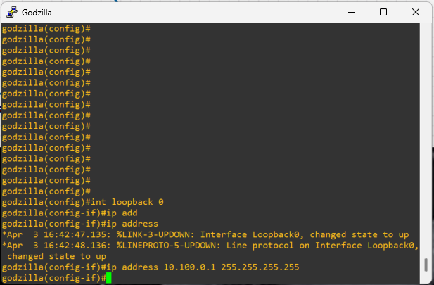
  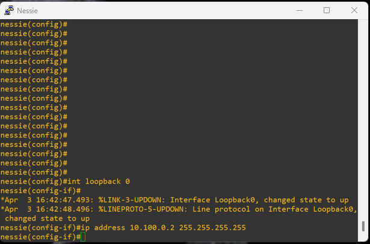 
  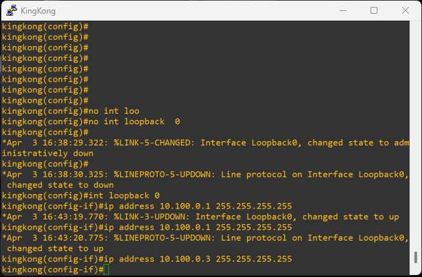

## OSPF Configuration and Routing Behavior
Configure OSPF on all routers using process ID 1. Assign router IDs manually using the respective loopback addresses. Enable OSPF on all active interfaces and advertise every configured interface's IP address into area 0, ensuring full inclusion in the backbone area. Verify that OSPF neighbor adjacencies are successfully established on all directly connected links. Confirm that all interface networks are dynamically advertised and learned via OSPF by inspecting the routing table, ensuring that routes appear as OSPF-learned entries and reflect complete topology convergence.

#### Answers 

  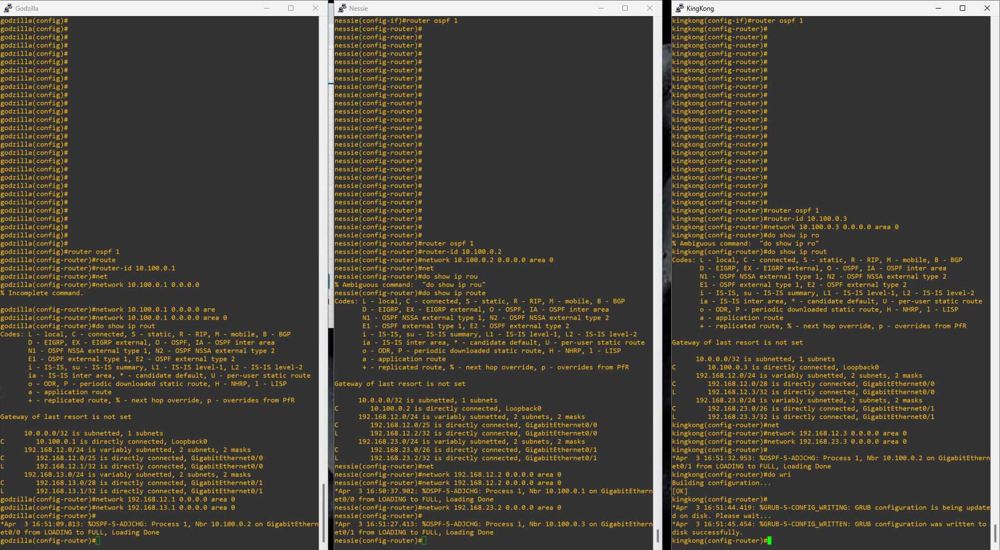

#### OSPF Routes

  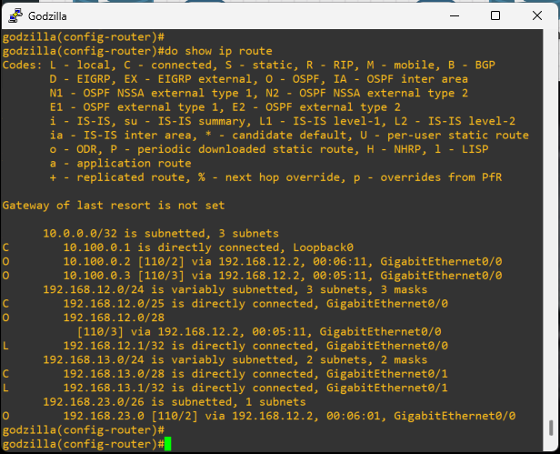
  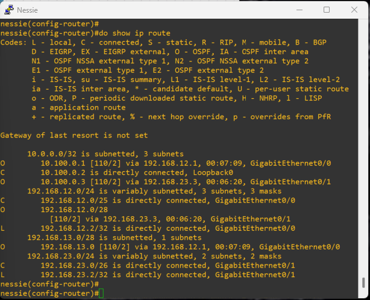 
  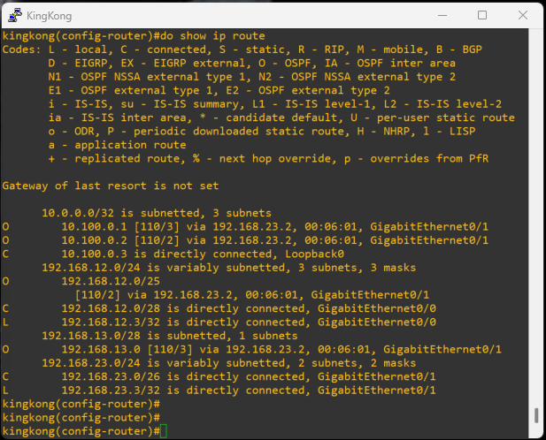

## Static and Default Routing
Configure a static route on one router to simulate external network access and configure a default route on godzilla. Verify that the default route is propagated through OSPF and appears in the routing tables of other routers.

#### Answers  

<table align="center">
  <tr>
    <td align="center">
      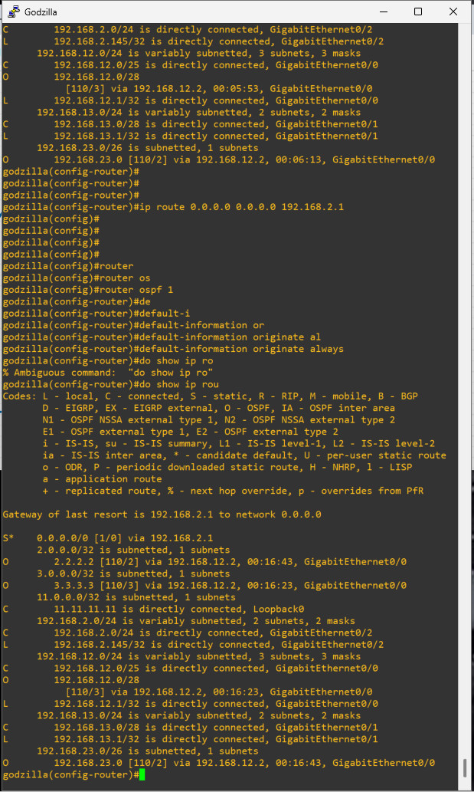
    </td>
    <td align="center">
      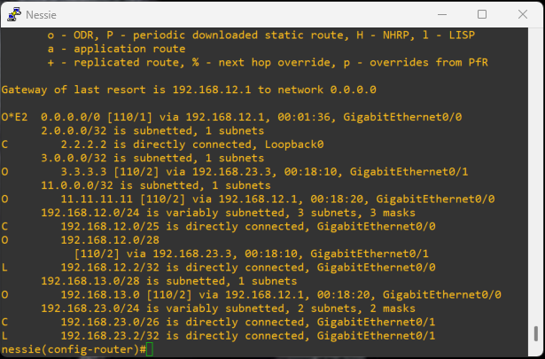  
      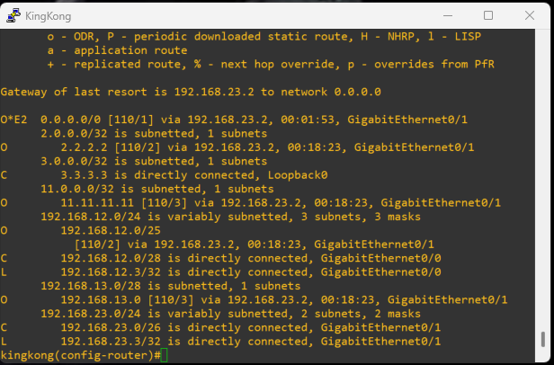
    </td>
  </tr>
</table>

## Final Objective
Ensure that all routers can reach all loopback networks, that OSPF is functioning correctly with stable adjacencies, and that routing tables reflect accurate and optimized paths. Confirm that the network can recover from failures and maintain full connectivity across all devices.

  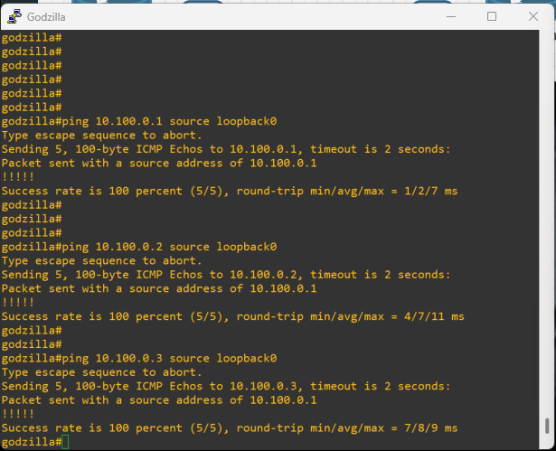
  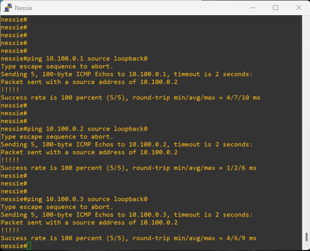 
  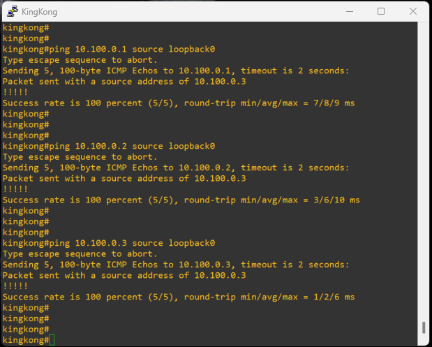

---

